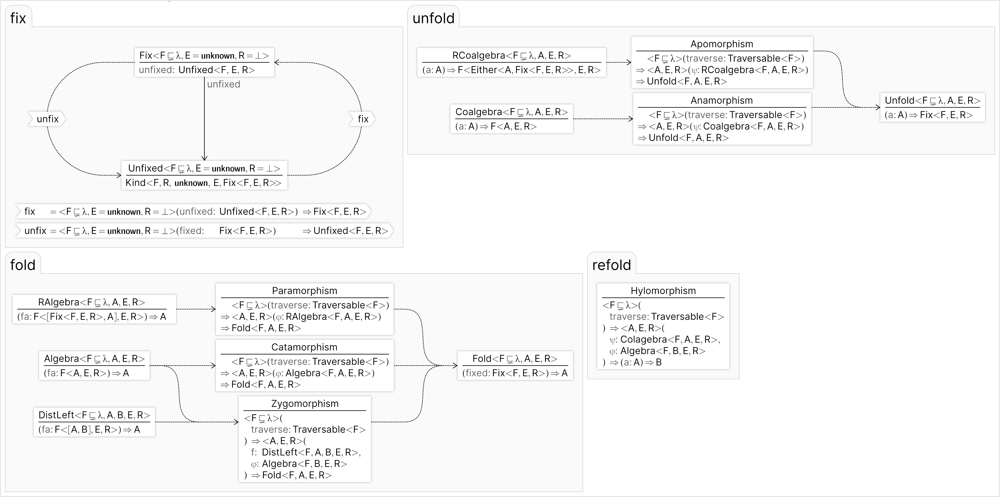

# effect-ts-folds

Recursion schemes for [effect-ts](https://effect.website/).

## Status

1. Folds
    1. Catamorphism
    2. Paramorphism
    3. Zygomorphism
    4. Histomorphism
2. Unfolds
    1. Anamorphism
    2. Apomorphism
3. Refolds
    1. hylomorphism
4. A version of all of the above that is lazy, allows running effects inside the
   operation, and returns the result wrapped in an `Effect` type.
5. Fuse folds/unfolds/refolds into tuples and structs.
6. [Stack-safety](tests/consList/stackSafety.spec.ts) using the `effect-ts`
   `Effect` type as a _continuation monad_.
7. Tests for all morphisms and combinators, and some
   [law tests](https://github.com/middle-ages/effect-ts-laws) for
   [folds](src/fold/laws.ts) and [unfolds](src/unfold/laws.ts).

### Types

## Limitations

No examples or documentation.

## More Info

1. [API Docs](https://middle-ages.github.io/effect-ts-folds-docs/modules.html)
2. [Haskell](https://hackage.haskell.org/package/recursion-schemes)
3. [Awesome recursion schemes](https://github.com/passy/awesome-recursion-schemes)
